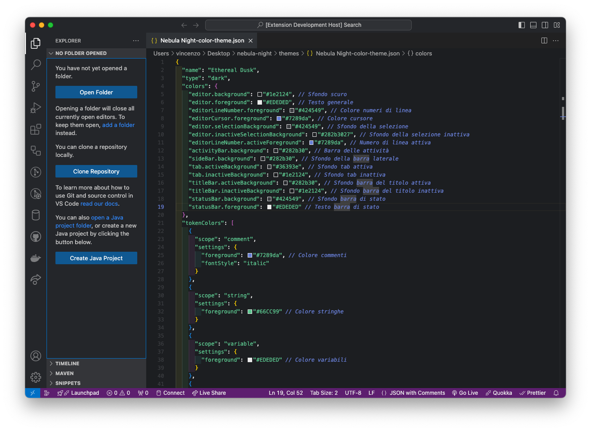

# Nebula Night

**Nebula Night** is a sleek Visual Studio Code theme inspired by the Discord color palette. Designed to provide a modern, dark interface that enhances code readability and reduces eye strain.

## Features

- **Discord-Inspired Colors**: Dark tones with vibrant accents for a stunning visual experience.
- **Wide Compatibility**: Works seamlessly with various programming languages and file types.
- **Customizable**: Easily adjust colors and settings to fit your preferences.

## Preview

### Editor

## Installation

1. Open **Visual Studio Code**.
2. Go to the **Extensions view** by clicking on the Extensions icon in the Activity Bar on the side or by pressing `Ctrl+Shift+X` (`Cmd+Shift+X` on macOS).
3. Search for **Nebula Night**.
4. Click **Install**.

## Usage

1. Open **Visual Studio Code**.
2. Go to **Settings** (`Ctrl + ,` or `Cmd + ,` on macOS).
3. Choose **Color Theme** and select **Nebula Night** from the list.

## Contributing

Contributions are welcome! If you would like to improve Nebula Night:

1. Fork the repository.
2. Create a new branch (`git checkout -b feature/your-feature`).
3. Make your changes and test thoroughly.
4. Submit a pull request with a description of your changes.

## License

Licensed under the [MIT License](LICENSE).

## Contact

For questions or feedback, open an [issue](https://github.com/vincenzomaritato/nebula-night/issues) or reach out on [Twitter](https://twitter.com/vincenzomaritato).
